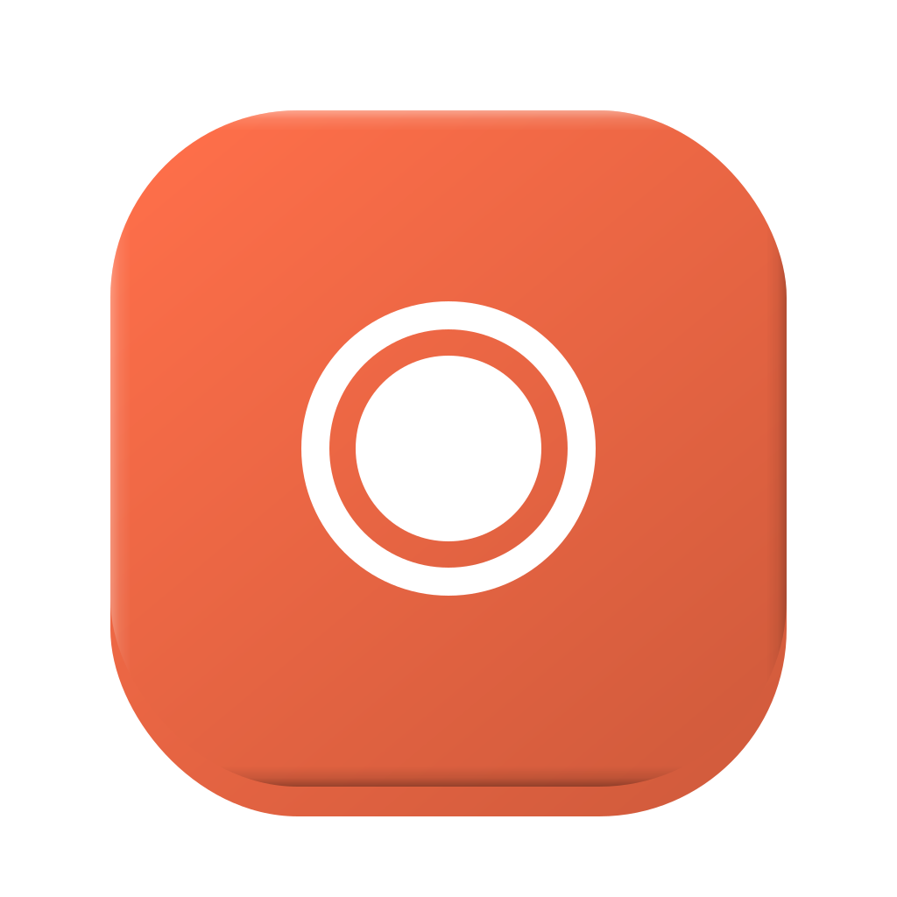
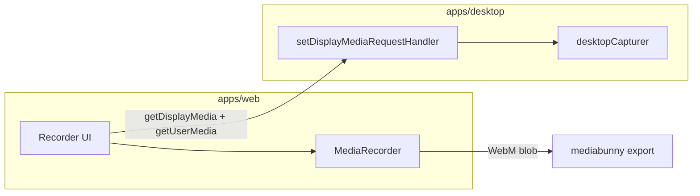

<p align="center">
  
</p>

<h1 align="center">Ceer</h1>

<p align="center">
  Desktop screen recorder — capture screens, windows, or a custom region, mix mic and system audio, then export.
</p>

## Features

- **Capture targets** — full display, individual windows, or a draggable **area** on screen (fullscreen overlay picker)
- **Audio mix** — toggle **system audio** (desktop loopback) and **microphone** independently before recording
- **Live preview** — arm a source, verify video and audio, then record
- **Recording** — in-app `MediaRecorder` to WebM (VP9/VP8 + Opus)
- **Export** — transcode to **MP4**, **MOV**, or WebM at **source**, **720p**, **1080p**, or **1440p** ([mediabunny](https://github.com/nickdesaulniers/mediabunny))
- **Packaging** — macOS `.dmg` and Windows NSIS installer via electron-builder

### Platform notes

- **System audio** on macOS requires **macOS 13+** and **Screen Recording** permission; loopback is most reliable for **screen** capture (window-only capture may have no audio).
- **Microphone** uses the browser `getUserMedia` path; grant mic access in System Settings when prompted.
- **Browser mode** (`bun run dev:web`) — record via the browser share picker; mic + export work; no source grid, area crop, or macOS loopback.
- **Desktop mode** (`bun run dev`) — full feature set via the Electron shell.

## Stack

- **Bun** workspaces + install
- **Turbo** task orchestration
- **`apps/desktop`** — Electron main, preload, area-picker window; bundled with **tsdown**
- **`apps/web`** — React recorder UI via **Vite** (not electron-vite)
- **`packages/contracts`** — shared TypeScript types for preload IPC

## Prerequisites

- [Bun](https://bun.sh) 1.2+
- macOS or Windows for distributable builds

### Package manager

This repo uses **Bun** (`bun.lock`, `node_modules/.bun`). If you see a `.pnpm-store` folder at the repo root, it was created incidentally (for example by `bunx shadcn` or a one-off `pnpm` run). It is safe to delete and is gitignored — it is not part of the normal Bun install.

## Develop

From the repo root:

```bash
bun install
bun run dev
```

This starts:

1. Vite (`@ceer/web`) on `http://localhost:5173`
2. `tsdown --watch` for Electron main, preload, and area-picker preload
3. Electron loading the Vite dev server (single instance; restarts when main/preload bundles change)

Override the host or port:

```bash
PORT=5174 HOST=127.0.0.1 bun run dev
```

Run the web UI in a browser (screen capture via the browser picker — use **Chrome** or **Edge** for best results):

```bash
bun run dev:web
```

Open `http://localhost:5173`, click **Share screen or window**, allow permissions, then record and export. Requires `localhost` or `https://` (secure context).

Desktop-only dev (same as `bun run dev` but scoped to desktop + web packages):

```bash
bun run dev:desktop
```

### Stuck or multiple dock icons?

If dev restarts leave several **Ceer (Dev)** icons in the dock, quit them or run:

```bash
bun run dev:kill
```

Then start dev again. Only one Electron instance should run; launching dev while the app is open focuses the existing window.

### Electron failed to install correctly

Bun does not run Electron’s download script unless the package is trusted. This repo sets `trustedDependencies: ["electron"]` and runs `scripts/ensure-electron.mjs` on `postinstall`.

If desktop dev still fails:

```bash
bun run setup:electron
bun run dev
```

Or reinstall from scratch:

```bash
rm -rf node_modules apps/*/node_modules
bun install
```

## Build

```bash
bun run build
```

Run the desktop app against the built web assets:

```bash
cd apps/desktop && bun run start
```

Typecheck all packages:

```bash
bun run typecheck
```

## Package installers

Build web + desktop, then run [electron-builder](https://www.electron.build/) from `apps/desktop`.

Stop `bun run dev` first — a running dev watcher can slow or interrupt the production build.

```bash
# macOS → apps/desktop/release/*.dmg
bun run dist:mac

# Windows → apps/desktop/release/*.exe (NSIS installer)
bun run dist:win
```

Config: `apps/desktop/electron-builder.yml`. Packaged UI is served from `process.resourcesPath/web/` (see `resolve-renderer.ts` and `main.ts`).

App icons live in `apps/desktop/resources/` (`icon.svg`, `icon.png`, `icon.icns`, `icon.ico`).

## Layout

```
ceer/
├── apps/
│   ├── desktop/
│   │   ├── src/
│   │   │   ├── main.ts                 # Window, display-media handler, IPC
│   │   │   ├── preload.ts              # desktopBridge
│   │   │   ├── area-picker.ts          # Region overlay window
│   │   │   ├── resolve-capture-source.ts
│   │   │   └── resolve-renderer.ts     # Production index.html path
│   │   ├── scripts/
│   │   │   ├── dev-electron.mjs        # Watch bundles, spawn/restart Electron
│   │   │   └── kill-dev-electron.mjs
│   │   └── resources/                  # Icons for app + dock
│   └── web/
│       └── src/
│           ├── components/recorder/     # Recorder UI
│           └── hooks/                  # Capture, export, sources
├── packages/
│   └── contracts/                      # DesktopBridge + IPC channel types
├── scripts/
│   ├── dev.mjs                         # Sets VITE_DEV_SERVER_URL, runs turbo dev
│   └── ensure-electron.mjs
├── turbo.json
└── package.json
```

## Architecture (recording)



- **Video** — `navigator.mediaDevices.getDisplayMedia` handled in main via `desktopCapturer` and the selected source ref.
- **System audio** — Electron `audio: "loopback"` when the system-audio toggle is on (macOS 13+).
- **Microphone** — separate `getUserMedia` stream, mixed in the renderer (`audio-mix.ts`).
- **Area crop** — optional region from the area-picker overlay; video cropped on a canvas stream before preview/record.
