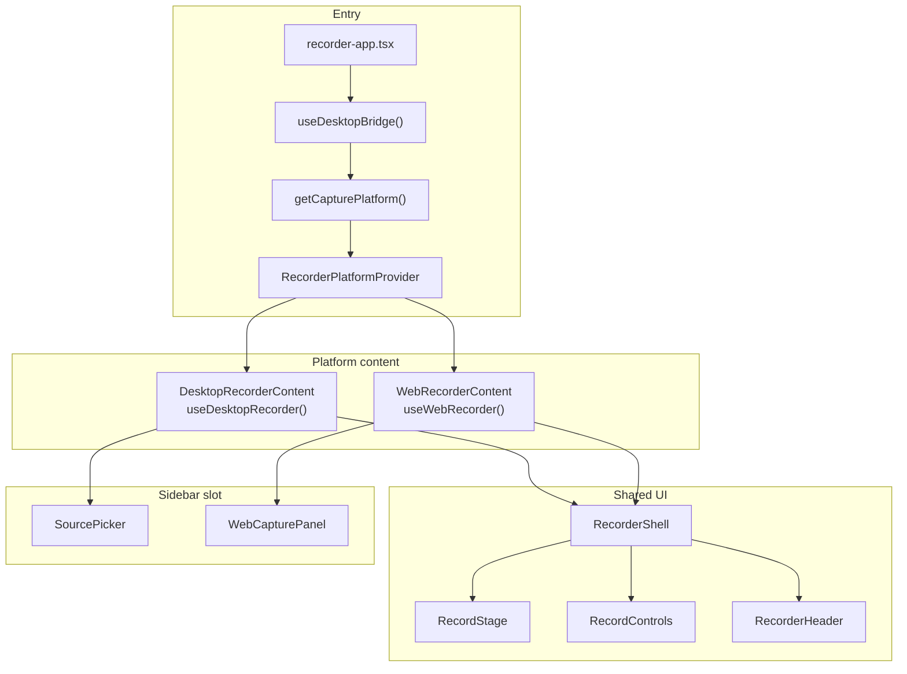
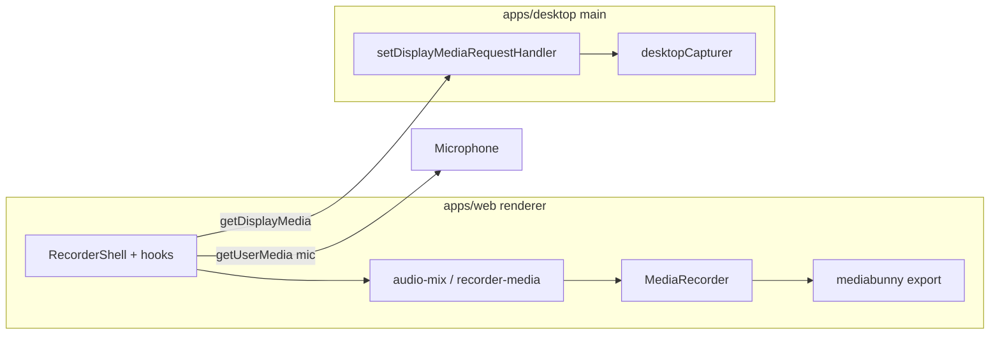

<p align="center">
  
</p>

<h1 align="center">Ceer</h1>

<p align="center">
  Screen recorder for desktop and browser — capture screens, windows, or a custom region, mix mic and system audio, then export.
</p>

## Features

| | **Desktop** (`bun run dev`) | **Browser** (`bun run dev:web`) |
|---|---------------------------|--------------------------------|
| Capture | Source grid, optional **area crop** | Browser **share picker** (tab / window / screen) |
| System audio | macOS loopback via Electron | Shared tab audio when the browser provides it (Chrome); often none on Firefox/Zen for window/screen |
| Microphone | Mixed in renderer | Optional; attach after share |
| Export | MP4, MOV, WebM at multiple resolutions | Same |

Shared everywhere:

- **Live preview** — arm or share a target, verify framing and audio, then record
- **Recording** — `MediaRecorder` → WebM (VP9/VP8 + Opus)
- **Export** — transcode with [mediabunny](https://github.com/nickdesaulniers/mediabunny)
- **Packaging** — macOS `.dmg` and Windows NSIS installer (desktop app only)

### Platform notes

**Desktop (Electron)**

- **System audio** on macOS needs **macOS 13+** and **Screen Recording** permission. Loopback is most reliable for **full screen** capture; window-only capture may have no audio.
- **Microphone** uses `getUserMedia`; grant access in System Settings when prompted.
- **Area crop** opens a fullscreen overlay (`area-picker`) to drag a region on the chosen display.

**Browser**

- Requires a **secure context** (`https://` or `localhost`).
- **Chrome / Edge** — pick a tab and enable “Share tab audio” in the dialog for system sound.
- **Firefox / Zen** — picker offers window or entire screen only (no tab list). Shared audio is usually unavailable; use **Mic** for narration. UI copy is browser-specific via `capture-platform.ts`.

## Recording flows

### Desktop

1. Pick a **screen** or **window** in the left sidebar (`SourcePicker`), or **snip a region** on a display.
2. Electron main resolves the source and handles `getDisplayMedia` via `desktopCapturer`.
3. Preview arms (`phase: armed`) — mix system audio + mic in the renderer (`audio-mix.ts`), optional crop (`crop-video-stream.ts`).
4. **Roll tape** → WebM chunks → stop → export or download master.

### Browser

1. Click **Share screen, window, or tab** (`WebCapturePanel`) — native picker opens (`previewLoading` while waiting).
2. Preview goes live (`phase: armed`); optional mic attach; record stream is pre-built before start (Firefox needs a synchronous `MediaRecorder.start()`).
3. **Roll tape** → stop → export. Informational banners (e.g. missing tab audio) appear once at the top of the shell, not duplicated in the sidebar.

Platform is chosen automatically: if `window.desktopBridge` exists (Electron preload), the app runs in **desktop** mode; otherwise **web**.

## Recorder architecture (UI)

One React tree, two capture backends, shared chrome.



| Layer | Role |
|-------|------|
| `recorder-app.tsx` | Entry; platform branch; desktop source/area state |
| `recorder-shell.tsx` | Layout, errors, web `shareAudioNotice` banner, `canRecord` / toggle disabled |
| `recorder-platform-context.tsx` | `RecorderPlatformProvider`; `useRecorderPlatformContext()` / `useIsWebRecorder()` / `useIsDesktopRecorder()` for shared UI (throws outside provider) |
| `use-desktop-recorder.ts` | Arm preview, audio remix, desktop `MediaRecorder` |
| `use-web-recorder.ts` | Share picker, mic attach, pre-warmed record stream |
| `recorder-api.ts` | Shared types: `RecorderCore`, `canArm`, discriminated union |
| `capture-platform.ts` | Platform detection, Firefox checks, share copy |
| `recorder-media.ts` | Display capture, Web Audio mux, codec selection, recorder start/stop |
| `recorder-session.ts` | `prepareRecordStream`, `finalizeChunks` |
| `audio-mix.ts` | Desktop-only preview/record audio mix |
| `recorder-types.ts` | `RecorderPhase`, `RecordingResult` |

Phases are aligned across platforms: `idle` → `armed` → `recording` → `stopping` → `stopped`. Web uses `previewLoading` during the share picker while `phase` stays `idle`.

## Architecture (media pipeline)



- **Desktop video** — `getDisplayMedia` in main via `desktopCapturer` and the selected `CaptureSourceRef`.
- **Desktop system audio** — Electron `audio: "loopback"` when enabled (macOS 13+).
- **Web video/audio** — Browser `getDisplayMedia` with Chrome `systemAudio` or Firefox `audio: true`; multi-track mux only when needed (`recorder-media.ts`).
- **Area crop** — Canvas crop on the mixed preview stream before record (desktop only).

## Stack

- **Bun** workspaces + install
- **Turbo** task orchestration
- **`apps/desktop`** — Electron main, preload, area-picker window; bundled with **tsdown**
- **`apps/web`** — React recorder UI via **Vite**
- **`packages/contracts`** — shared TypeScript types for preload IPC (`DesktopBridge`, capture refs)

## Prerequisites

- [Bun](https://bun.sh) 1.2+
- macOS or Windows for distributable desktop builds

### Package manager

This repo uses **Bun** (`bun.lock`, `node_modules/.bun`). A `.pnpm-store` folder at the repo root, if present, is incidental and gitignored — safe to delete.

## Develop

From the repo root:

```bash
bun install
bun run dev
```

Starts:

1. Vite (`@ceer/web`) on `http://localhost:5173`
2. `tsdown --watch` for Electron main, preload, and area-picker preload
3. Electron loading the Vite dev server (single instance; restarts when main/preload bundles change)

Override host or port:

```bash
PORT=5174 HOST=127.0.0.1 bun run dev
```

**Browser-only UI** (no Electron bridge — web capture path):

```bash
bun run dev:web
```

Open `http://localhost:5173`, share a target, then record and export.

**Desktop-scoped dev** (same as `bun run dev`, filtered packages):

```bash
bun run dev:desktop
```

### Stuck or multiple dock icons?

```bash
bun run dev:kill
```

Then `bun run dev` again. Only one Electron instance should run.

### Electron failed to install correctly

```bash
bun run setup:electron
bun run dev
```

Or clean reinstall:

```bash
rm -rf node_modules apps/*/node_modules
bun install
```

## Build

```bash
bun run build
```

Run the desktop app against built web assets:

```bash
cd apps/desktop && bun run start
```

Typecheck all packages:

```bash
bun run typecheck
```

### App icons

Edit `apps/desktop/resources/icon.svg`, then regenerate raster assets (desktop dock/installer + web favicons):

```bash
bun run generate:icons
```

Outputs `icon.png` (transparent corners), `icon.icns`, `icon.ico`, and `icon.iconset/`. `scripts/generate-icons.mjs` parses `icon.svg` and rasterizes it in pure Node (no npm deps); `.icns` uses macOS `iconutil`. Vite copies/serves the SVG and ICO from `apps/desktop/resources/` for the web app.

## Package installers

Stop `bun run dev` before production builds.

```bash
# macOS → apps/desktop/release/*.dmg
bun run dist:mac

# Windows → apps/desktop/release/*.exe (NSIS)
bun run dist:win
```

Config: `apps/desktop/electron-builder.yml`. Packaged UI is served from `process.resourcesPath/web/` (`resolve-renderer.ts`, `main.ts`). Icons: `apps/desktop/resources/`.

## Repository layout

```
ceer/
├── apps/
│   ├── desktop/
│   │   ├── src/
│   │   │   ├── main.ts              # Window, display-media handler, IPC
│   │   │   ├── preload.ts           # desktopBridge
│   │   │   ├── area-picker.ts       # Region overlay window
│   │   │   ├── resolve-capture-source.ts
│   │   │   └── resolve-renderer.ts
│   │   └── resources/               # icon.svg (source) + generated png/icns/ico
│   └── web/
│       └── src/
│           ├── components/recorder/
│           │   ├── recorder-app.tsx           # Entry + platform branch
│           │   ├── recorder-shell.tsx         # Shared layout
│           │   ├── recorder-platform-context.tsx
│           │   ├── source-picker.tsx          # Desktop sidebar
│           │   ├── web-capture-panel.tsx      # Browser sidebar
│           │   ├── record-stage.tsx
│           │   ├── record-controls.tsx
│           │   ├── recorder-header.tsx
│           │   └── area-picker-page.tsx
│           ├── hooks/
│           │   ├── use-desktop-recorder.ts
│           │   ├── use-web-recorder.ts
│           │   ├── recorder-api.ts
│           │   ├── recorder-types.ts
│           │   ├── use-desktop-bridge.ts
│           │   ├── use-desktop-sources.ts
│           │   └── use-recording-export.ts
│           └── lib/
│               ├── capture-platform.ts
│               ├── recorder-media.ts
│               ├── recorder-session.ts
│               ├── audio-mix.ts
│               ├── crop-video-stream.ts
│               └── export-recording.ts
├── packages/contracts/              # IPC + capture types
├── scripts/
│   ├── dev.mjs
│   └── ensure-electron.mjs
└── package.json
```
