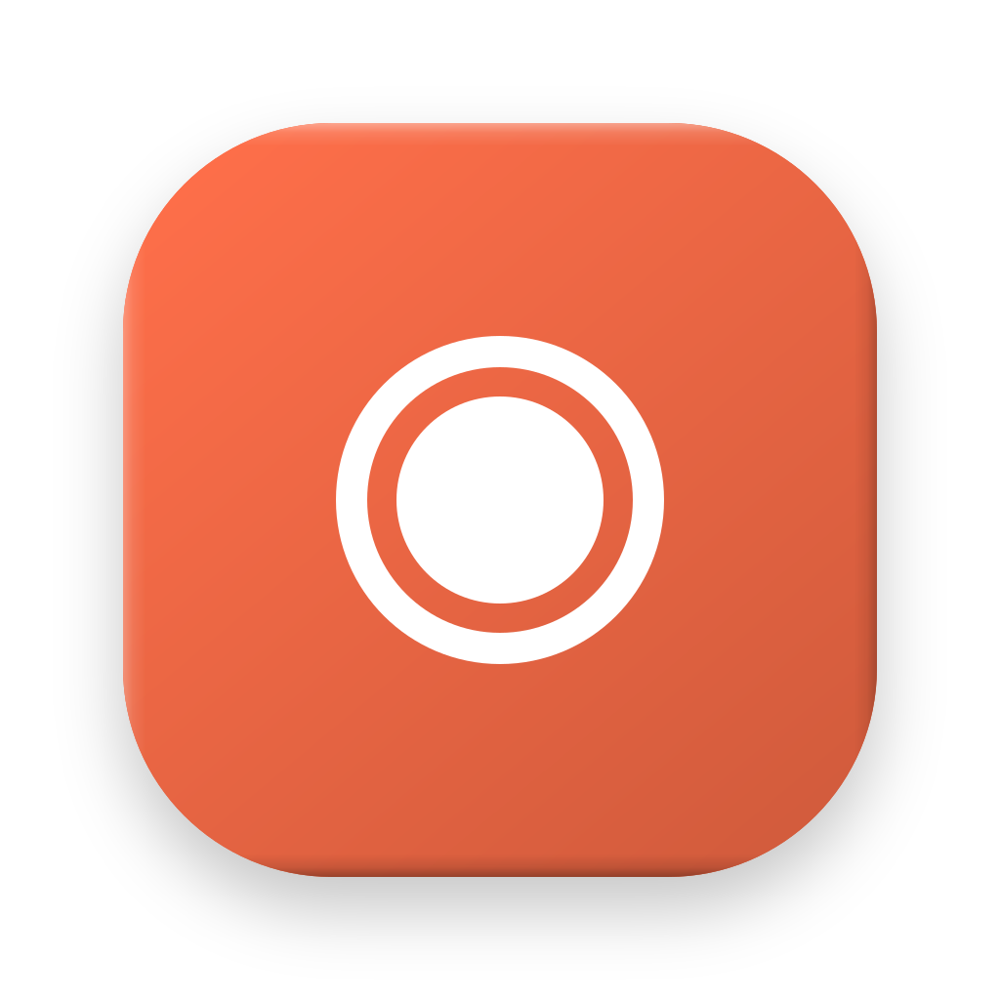
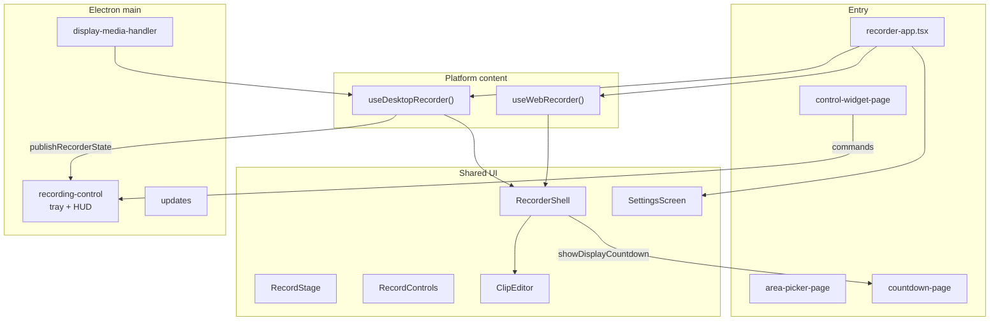
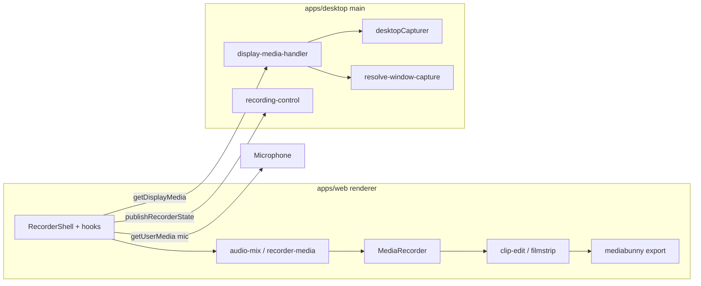

<p align="center">
  
</p>

<h1 align="center">Ceer</h1>

<p align="center">
  Screen recorder for desktop and browser — capture screens, windows, or a custom region, mix mic and system audio, trim on a timeline, then export up to 4K.
</p>

<p align="center">
  <a href="LICENSE">MIT License</a>
</p>

## Features

| | **Desktop** (`bun run dev`) | **Browser** (`bun run dev:web`) |
|---|---------------------------|--------------------------------|
| Capture | Source grid, **area crop**, tray/HUD switching | Browser **share picker** (tab / window / screen) |
| Background control | Menu bar **tray** + floating **HUD** | — |
| System audio | macOS loopback via Electron | Shared tab audio when the browser provides it (Chrome); often none on Firefox/Zen for window/screen |
| Microphone | Mixed in renderer | Optional; attach after share |
| Quality | **720p–4K** capture cap, **30/60 fps** | Same constraints where the browser allows |
| Countdown | Fullscreen **3-2-1** on the primary display | In-app overlay |
| Export | MP4, MOV, WebM at **720p–4K** | Same |
| Updates | **Auto-update** from GitHub releases | — |

Shared everywhere:

- **Live preview** — arm or share a target, verify framing and audio, then record
- **Recording** — `MediaRecorder` → WebM (VP9/VP8 + Opus) with adaptive bitrate
- **Clip editor** — split, trim, mute, and delete on a dual-track timeline (picture + audio) with filmstrip and waveform
- **Export** — transcode with [mediabunny](https://github.com/nickdesaulniers/mediabunny)
- **Settings** — theme, countdown, capture defaults, and (desktop) permission shortcuts
- **Packaging** — macOS `.dmg` / `.zip` and Windows NSIS installer (desktop app only)

### Platform notes

#### Desktop (Electron)

| Topic | Behavior |
|-------|----------|
| **Targets** | Screens and windows from the sidebar or tray menu. No OS share dialog — the main process selects via `desktopCapturer`. |
| **Region snip** | Fullscreen overlay with a source strip (switch targets live), background preview, then drag a rectangle. |
| **Window capture** | On macOS, single-window picks use **screen capture + crop** (`resolveWindowCapture`) so Mission Control / Exposé does not warp the stream. |
| **System audio** | macOS 13+ with Screen Recording permission. Loopback is most reliable for **full-screen** capture; single-window capture may have no system audio. |
| **Microphone** | `getUserMedia` — allow access when macOS or Windows prompts. |
| **Permissions** | First launch shows a setup screen when Screen Recording is missing. Settings → **Permissions** links to OS privacy panes and can relaunch after granting access. |
| **Tray** | Pick targets, snip, refresh the list, start/stop, show the main window, show/hide the control bar, or quit. While recording, the tooltip shows elapsed time. Tray selection arms preview without stealing focus from other apps. |
| **Control bar (HUD)** | Small floating bar (timer, record/stop, open app, hide bar). Appears when a target is armed or while recording. The main window can hide during capture (setting) and reopens for export after stop. |
| **Lifecycle** | Close/minimize hides to the tray (use **Quit** in the menu to exit). Notifications on start/stop; click to focus the app. |
| **Updates** | `electron-updater` polls GitHub releases (15 s after launch, then every 30 min). Download and install from **Settings → About**. |

**macOS**

- **Screen Recording permission** is required to list screens/windows and capture video. If sources fail to load, open **System Settings → Privacy & Security → Screen & System Audio Recording** and enable the app you are actually running.
- **Development vs packaged app:** `bun run dev` launches the Electron binary (`Electron` or **Ceer (Dev)** in the list). A built **Ceer.app** is a separate entry (`Ceer` / **Ceer.app**). macOS tracks permissions per binary, so you may see two Ceer-related rows — enable the one that matches how you launched the app, or reset stale entries with `tccutil reset ScreenCapture` and grant again on next launch.
- Apps in a native fullscreen Space often disappear from the **Windows** list — choose the matching **Screen** instead.
- Screen picks store a `displayId` so the same monitor stays selected after Exposé or Mission Control even when Electron source IDs change.
- Tray: **right-click** the menu bar icon. HUD uses a `panel` window so it can sit above other apps’ fullscreen modes.

**Windows**

- Tray: **left-click** the notification area icon to show Ceer; **right-click** to open the menu. If the icon is hidden, open the overflow area (**^**) in the taskbar notification corner.
- HUD: floating control bar appears when a target is armed or while recording.

#### Browser

Requires a [secure context](https://developer.mozilla.org/en-US/docs/Web/Security/Secure_Contexts) (`https://` or `localhost`). Capture always goes through the browser’s native share dialog.

| | Chrome / Edge | Firefox / Zen |
|---|---------------|---------------|
| Picker | Tab, window, or screen | Window or entire screen only (no tab list) |
| System audio | Enable **Share tab audio** when sharing a tab | Usually none for window/screen — use **Mic** |
| UI copy | “Share screen, window, or tab” | “Share window or screen” (`capture-platform.ts`) |

If shared audio is missing, a banner explains the limitation once at the top of the recorder (not in the sidebar).

## Settings

Open **Settings** from the studio header (gear icon). Preferences persist in `localStorage` (`ceer-settings:v1`).

| Tab | Options |
|-----|---------|
| **General** | Dark / light theme; **3-second countdown** before recording |
| **Capture** | Resolution cap (native, 720p, 1080p, 1440p, 4K); frame rate (30 / 60 fps); system audio; microphone; hide main window while recording (desktop) |
| **Permissions** | Screen Recording and microphone status with shortcuts to OS privacy settings (desktop) |
| **About** | App version; check, download, and install updates (desktop, packaged builds only) |

## Clip editor

After you stop a take, the **clip editor** opens instead of a bare export dialog.

- **Timeline** — separate picture and audio tracks with filmstrip thumbnails and a waveform
- **Edit** — split at the playhead, trim clip edges, delete clips, mute audio segments
- **Playback** — preview kept duration; keyboard shortcuts: `Space` play/pause, `S` split, `M` mute, `⌫` delete
- **Export** — WebM (original), MP4, or MOV at source, 720p, 1080p, 1440p, or **4K (2160p)**

Edits are non-destructive until export — **Reset** restores the full recording.

## Recording flows

### Desktop

**First launch**

1. If Screen Recording is not granted, the **permission setup** screen walks you through allowing access and relaunching.
2. Sources appear in the sidebar once macOS/Windows permissions are in place.

**Main window**

1. Pick a **screen** or **window** in the sidebar (`SourcePicker`), or **snip a region** (overlay lets you switch targets, then draw).
2. Main resolves the source; `display-media-handler.ts` satisfies `getDisplayMedia` via `desktopCapturer` (no OS picker). Window targets may use a screen+crop plan.
3. Preview arms (`phase: armed`) — apply capture resolution/fps, mix system audio + mic (`audio-mix.ts`), optional crop (`crop-video-stream.ts`). HUD appears when armed.
4. **Roll tape** (main window or HUD) → optional **3-2-1 countdown** (fullscreen on primary display) → main window hides (if enabled) → stop → **clip editor** → export.

**Menu bar tray**

1. Open the tray menu → choose a screen/window or **Snip region…**.
2. **Start recording** when enabled (preview must be armed).
3. Stop from the HUD or tray; edit and export in the main window.

### Browser

1. Click **Share screen, window, or tab** (`WebCapturePanel`) — native picker opens (`previewLoading` while waiting).
2. Preview goes live (`phase: armed`); optional mic attach; record stream is pre-built before start (Firefox needs a synchronous `MediaRecorder.start()`).
3. **Roll tape** → optional in-app countdown → stop → clip editor → export. Informational banners (e.g. missing tab audio) appear once at the top of the shell.

Platform is automatic: `window.desktopBridge` (Electron preload) → desktop mode; otherwise web.

## Recorder architecture (UI)

One React tree, two capture backends, shared chrome. Vite entry modes via `?mode=`: default recorder, `area-picker`, `control-widget`, `countdown`.


```mermaid
flowchart TB
  subgraph entry [Entry]
    App["recorder-app.tsx"]
    Area["area-picker-page"]
    Hud["control-widget-page"]
    Cd["countdown-page"]
  end

  subgraph content [Platform content]
    Desktop["useDesktopRecorder()"]
    Web["useWebRecorder()"]
  end

  subgraph shell [Shared UI]
    Shell["RecorderShell"]
    Stage["RecordStage"]
    Controls["RecordControls"]
    Editor["ClipEditor"]
    Settings["SettingsScreen"]
  end

  subgraph main [Electron main]
    RC["recording-control\ntray + HUD"]
    DM["display-media-handler"]
    Upd["updates"]
  end

  App --> Desktop
  App --> Web
  Desktop --> Shell
  Web --> Shell
  Shell --> Editor
  App --> Settings
  Desktop -->|publishRecorderState| RC
  Hud -->|commands| RC
  DM --> Desktop
  Shell -->|showDisplayCountdown| Cd
```

| Layer | Role |
|-------|------|
| `recorder-app.tsx` | Entry; platform branch; desktop source/area state; permission gate |
| `use-desktop-recorder.ts` | Arm preview, window-crop follow, audio mix, `MediaRecorder`; publishes state to main |
| `use-web-recorder.ts` | Share picker, mic attach, pre-warmed record stream |
| `recording-control.ts` | Tray menu, HUD lifecycle, notifications |
| `recorder-shell.tsx` | Shared layout, countdown, errors, record toggles; opens clip editor on stop |
| `clip-editor.tsx` | Timeline edit + export UI |
| `settings-screen.tsx` | Theme, capture defaults, permissions, updates |
| `recorder-media.ts` / `audio-mix.ts` | Capture, mux, codecs, quality constraints |
| `@ceer/contracts` | `DesktopBridge`, capture refs, `RecorderRemoteState`, update types |

Phases: `idle` → `armed` → `recording` → `stopping` → `stopped`. Web uses `previewLoading` during the share picker while `phase` stays `idle`.

## Architecture (media pipeline)


```mermaid
flowchart LR
  subgraph renderer [apps/web renderer]
    UI[RecorderShell + hooks]
    Mix[audio-mix / recorder-media]
    MR[MediaRecorder]
  UI --> Mix --> MR
    MR --> Edit[clip-edit / filmstrip]
    Edit --> Export[mediabunny export]
  end

  subgraph main [apps/desktop main]
    DMH[display-media-handler]
    DC[desktopCapturer]
    RC[recording-control]
    RW[resolve-window-capture]
    DMH --> DC
    DMH --> RW
  end

  UI -->|getDisplayMedia| DMH
  UI -->|getUserMedia mic| Mic[Microphone]
  UI -->|publishRecorderState| RC
```

- **Desktop video** — `getDisplayMedia` in main via `display-media-handler` → `desktopCapturer` and the selected `CaptureSourceRef`.
- **Desktop window crop** — macOS window picks capture the parent screen and crop to window bounds to avoid Mission Control stream warping.
- **Desktop system audio** — Electron `audio: "loopback"` when enabled (macOS 13+).
- **Web video/audio** — Browser `getDisplayMedia`; multi-track mux when needed (`recorder-media.ts`).
- **Area crop** — Canvas crop on the preview stream before record (desktop only).
- **Quality** — `video-quality.ts` applies resolution/fps constraints and adaptive `MediaRecorder` bitrates.

## Stack

- **Bun** workspaces + **Turbo**
- **`apps/desktop`** — Electron main, preload, area-picker + control-widget + countdown windows (**tsdown**)
- **`apps/web`** — React recorder UI (**Vite**)
- **`packages/contracts`** — shared IPC types (`DesktopBridge`, capture refs, remote state, updates)

## Prerequisites

- [Bun](https://bun.sh) 1.2+
- **Node ≥ 22.18** (for packaging)
- macOS or Windows for distributable desktop builds

## Develop

From the repo root:

```bash
bun install
bun run dev
```

[`scripts/dev.ts`](scripts/dev.ts) starts in parallel:

1. Vite (`@ceer/web`) on `http://localhost:5173`
2. `tsdown --watch` for Electron main, preload, area-picker preload, control-widget preload, and countdown preload
3. Electron loading the Vite dev server (restarts when main/preload bundles change)

Override host or port:

```bash
PORT=5174 HOST=127.0.0.1 bun run dev
```

**Browser-only** (no Electron bridge):

```bash
bun run dev:web
```

**Desktop** (alias for the same orchestration as `dev`):

```bash
bun run dev:desktop
```

### Stuck or multiple dock icons?

```bash
bun run stop
```

Then `bun run dev` again.

### Electron failed to install

```bash
bun run setup:electron
bun run dev
```

Or clean reinstall: `rm -rf node_modules apps/*/node_modules && bun install`

## Build

```bash
bun run build
bun run typecheck
cd apps/desktop && bun run start   # run against built web assets
```

### App icons

Edit `apps/desktop/resources/icon.svg`, then:

```bash
bun run generate:icons
```

## Package installers

Stop `bun run dev` before building.

From the repo root:

```bash
bun run dist:mac   # DMG (+ zip) → apps/desktop/dist-out/
bun run dist:win   # NSIS → apps/desktop/dist-out/*.exe
```

`dist:mac` detaches stale mounted DMG volumes before packaging so rebuilds do not fail.

### CI / arch-specific builds

[`scripts/build-desktop-artifact.ts`](scripts/build-desktop-artifact.ts) is used by GitHub Actions and supports explicit platform/arch targets:

```bash
bun run dist:desktop:dmg           # macOS DMG (host arch)
bun run dist:desktop:dmg:arm64     # Apple Silicon
bun run dist:desktop:dmg:x64       # Intel Mac
bun run dist:desktop:win           # Windows NSIS x64
```

Desktop-only (after `bun run build`):

```bash
cd apps/desktop && bun run dist:mac   # or dist:win
```

Quit any **Ceer** window from `dist-out/win-unpacked` before rebuilding, or run `bun run stop`.

Config: `apps/desktop/electron-builder.yml`. Packaged UI is served from `process.resourcesPath/web/`. macOS bundles are ad-hoc signed when no Apple Developer certificate is configured.

## Releases

Pushing a semver tag (`v*.*.*`) or running the **Release** workflow manually builds macOS (arm64 + x64) and Windows artifacts and publishes a GitHub release. The desktop app checks that feed for updates (`electron-updater`).

## License

[MIT](LICENSE) — Copyright © 2026 Pranav Goel
